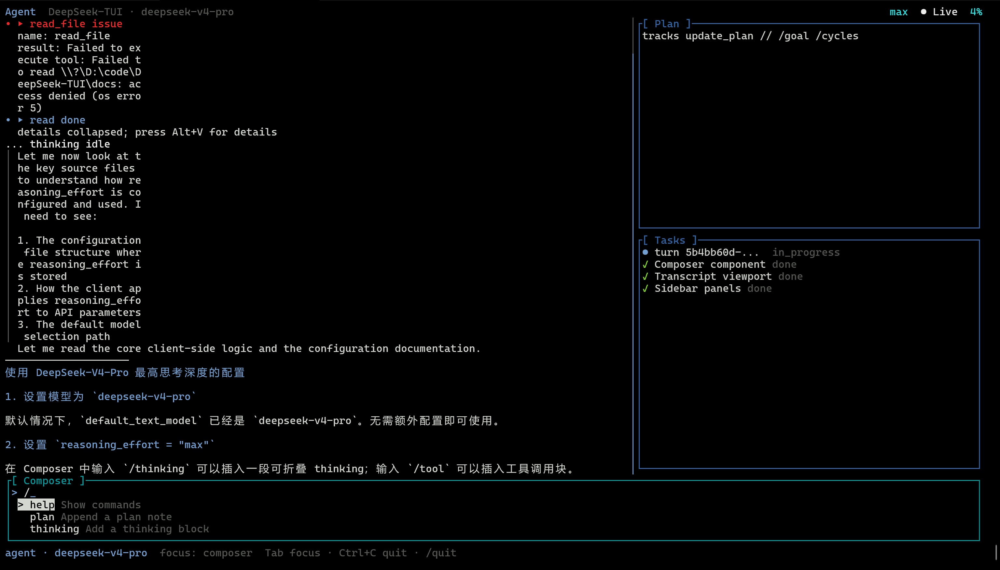

# RubyRich - Ruby 终端富文本工具库



受 Python Rich 启发开发的现代化 Ruby 终端 UI 工具库

## ✨ 功能特性

- 🖥️ **终端输出** - 自动色彩检测的优雅格式化输出
- 📊 **进度条** - 带速度/时间预估的多功能进度条
- 🧩 **面板布局** - 创建带边框和样式的嵌套布局
- 🎨 **文本样式** - 支持 RGB/HEX 颜色的链式文本样式
- 📜 **表格系统** - 自动扩展的表格支持列对齐和样式
- 🖼️ **语法高亮** - 内置 200+ 编程语言支持
- 📈 **状态显示** - 带实时动画的持久状态显示

## 📦 安装

添加到 Gemfile:
```ruby
gem 'ruby_rich'
```

或直接安装:
```bash
gem install ruby_rich
```

## 🚀 快速开始

```ruby
require 'ruby_rich'

# 初始化控制台
console = RubyRich::Console.new

# 基础样式打印
console.print("[bold green]操作成功![/bold green] [italic]文件已保存[/italic]")

# 创建信息面板
panel = RubyRich::Panel.new(
  "[blue]系统信息[/blue]\nCPU: 42%\n内存: 38%",
  title: "状态",
  border_style: "round",
  padding: 1
)
console.print(panel)

# 生成表格
table = RubyRich::Table.new("用户报告", columns: 3)
table.add_row("姓名", "年龄", "状态")
table.add_row("[cyan]张三[/cyan]", "28", "[green]活跃[/green]")
console.print(table)

# 进度条使用
RubyRich::ProgressBar.new("处理中...").with_progress do |bar|
  10.times do |i|
    sleep 0.1
    bar.advance(10, desc: "步骤 #{i+1}")
  end
end
```

## 📚 高级功能

### 主题系统
```ruby
theme = RubyRich::Theme.agent_dark

puts theme.style("Agent", :accent)
puts theme.style("thinking collapsed", :thinking)

custom = RubyRich::Theme.new(
  border: :blue,
  focused_border: :cyan,
  roles: {
    accent: { color: :blue, bright: true, bold: true },
    warning: { color: :yellow, bright: true }
  }
)
```

### 布局系统
```ruby
layout = RubyRich::Layout.new(
  header: "[bold]应用仪表盘[/bold]",
  footer: "[dim]按 F1 获取帮助[/dim]",
  columns: 2
)
layout.add_column("主内容区", width: 70)
layout.add_column("侧边栏")
console.print(layout)
```

### Agent TUI 应用壳
```ruby
app = RubyRich::AppShell.new(
  title: "Agent",
  subtitle: "DeepSeek-TUI · deepseek-v4-pro",
  model: "deepseek-v4-pro"
)

app.update_plan("tracks update_plan // /goal /cycles")
app.set_tasks([{ label: "turn demo", status: :in_progress }])
app.add_user("如何配置模型？")
app.add_thinking("正在检查配置文件。", status: "idle", collapsed: true)
app.add_assistant("把模型设为 `deepseek-v4-pro`，并把 reasoning_effort 设为 `max`。")
app.start
```

运行完整交互示例:
```bash
ruby -Ilib examples/tui_agent_shell.rb
```

## 🤝 贡献指南

1. Fork 本仓库
2. 新建功能分支 (`git checkout -b feature/新功能`)
3. 提交修改 (`git commit -m '添加新功能'`)
4. 推送分支 (`git push origin feature/新功能`)
5. 提交 Pull Request

## 📄 开源协议

MIT 协议 - 详见 [LICENSE](LICENSE)
