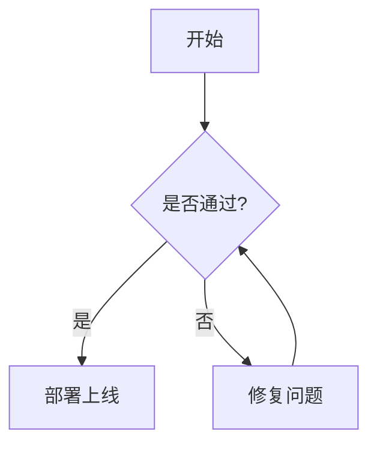
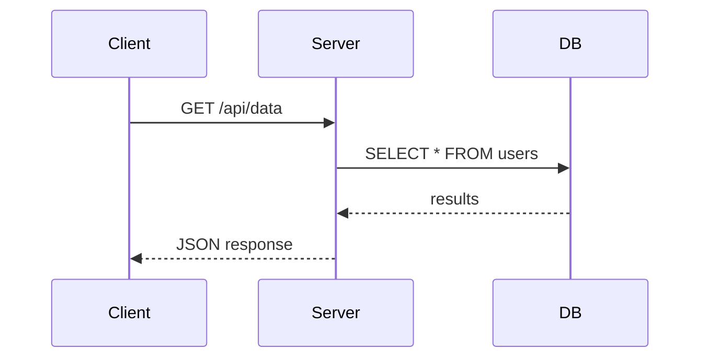

```mermaid
flowchart TD
    A[开始] --> B{是否通过?}
    B -->|是| C[部署上线]
    B -->|否| D[修复问题]
    D --> B
```

```mermaid
sequenceDiagram
    Client->>Server: GET /api/data
    Server->>DB: SELECT * FROM users
    DB-->>Server: results
    Server-->>Client: JSON response
```